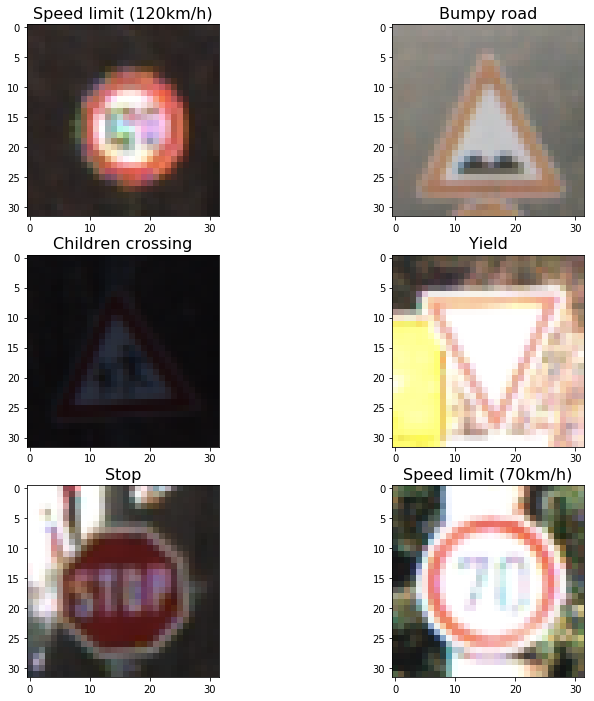
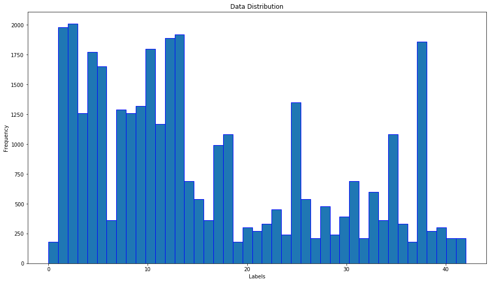
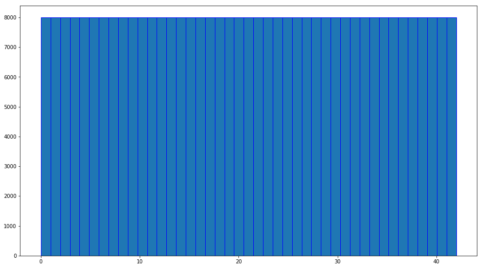
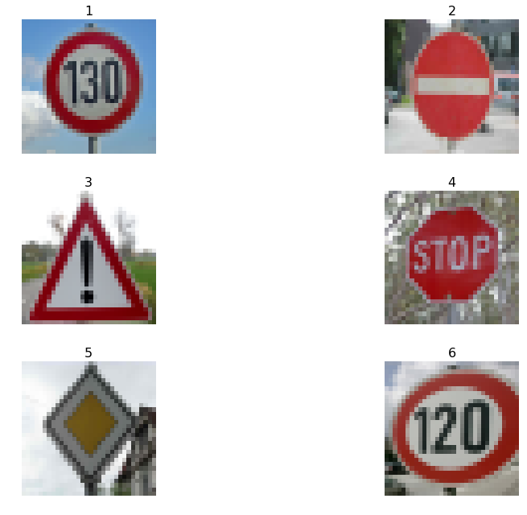
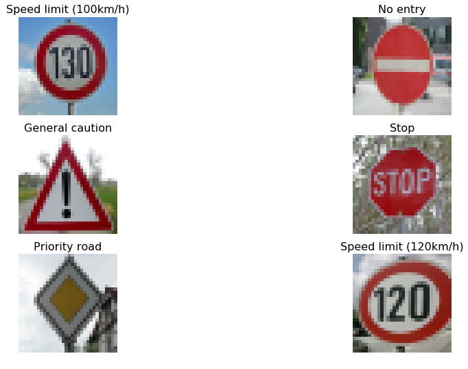
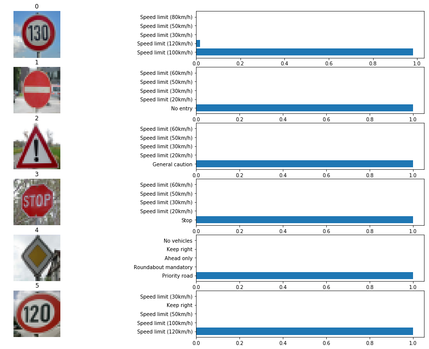

## Project: Build a Traffic Sign Recognition Program

Overview
---
This project is an implementation of Traffic Sign Recognition using Convolutional Neural Networks. 
* The German Traffic Sign image database is located [here](http://benchmark.ini.rub.de/?section=gtsrb&subsection=dataset). 
* The Ipython notebook is located [here](/Traffic_Sign_Classifier.ipynb). 
* HTML version of .ipynb file is located [here](/Traffic_Sign_Classifier.html).
* PDF version of .ipynb file is located [here](/traffic_sign_classifier.pdf).

Data Set Exploration
---
The data set is imported by loading the pickle (*.p) files. 
The data set contains training, validation and test data. 

Using numpy, we can get a basic summary of the data 
```import numpy as np
# TODO: Number of training examples
n_train = np.size(X_train,0)
# TODO: Number of testing examples.
n_test = np.size(X_test,0)

# TODO: What's the shape of an traffic sign image?
image_shape = str(np.size(X_train,1))+' x '+str(np.size(X_train,2))

# TODO: How many unique classes/labels there are in the dataset.
n_classes = np.size(np.unique(y_train),0) #done

print("Number of training examples =", n_train)
print("Number of testing examples =", n_test)
print("Image data shape =", image_shape)
print("Number of classes =", n_classes)
```

Here is the output of the code above looks 
```
Number of training examples = 34799
Number of testing examples = 12630
Image data shape = 32 x 32
Number of classes = 43
```
We have 34799 samples of images in the training dataset. 

Taking a Deep dive in data set
---
Lets look at six random images from the training data set. 
The sign names are imported into an array from the csv file. 
The appropriate sign name is then added as the title of the given image. 



We will now try to identify the distribution of the sample images in training data set. 



The above histogram shows that the samples are not uniformly distributed. Some labels have too many samples and some have very few. 
This could cause the network to have less accuracy since enough samples are not available to train. 

```
unique_labels, unique_count = np.unique(y_train, return_counts=True) #done
y_index=[]
for idx, val in enumerate(unique_count):
    if val <= 3000:
        print(idx,val)
        y_index = np.append(y_index,np.where(y_train==int(idx))) 
```

This code section will return the number of samples for each label. 
```
0 180
1 1980
2 2010
3 1260
4 1770
5 1650
6 360
7 1290
8 1260
9 1320
10 1800
11 1170
12 1890
13 1920
14 690
15 540
16 360
17 990
18 1080
19 180
20 300
21 270
22 330
23 450
24 240
25 1350
26 540
27 210
28 480
29 240
30 390
31 690
32 210
33 599
34 360
35 1080
36 330
37 180
38 1860
39 270
40 300
41 210
42 210
``` 
As seen from the output, some labels have as little as 180 sample images (label 0), while some have as many as 1860 (label 38)

Data Augmentation
---
The original data set channeled through a neural network resulted in poor accuracy ~89%. Changing the layers, hyper parameters, pre-processing techniques, resulted in minor improvements in accuracy. It seemed the network won't train well on the data set if it doesn't contain enough samples. To make the training data set more uniform, the following code section augments the images, and appends them to the original data. 
 
```
new count = 8000
while count of each label is less than new count
	randomly pick 1 to 5
	1. rotate the image
	2. translate the image
	3. add noise
	4. blur the image
	5. perform all of the above 
append new image to training data set, also append correct label 
end while loop
```
This while loop will append augmented images to the original data set until all labels have 8000 images.
This ensures the data is uniformly distributed, further the noise, translation, blurring and rotation helps in making the model robust.



As seen from the above distribution we have modified the distribution of the original data set. We have also increased the number of samples by approximately 10 times. 

```
Original number of samples in training data: 34799
Number of samples in training data after adding augmented images: 344043
```
Step 2: Design and Test a Model Architecture
---
### Pre-process the Data Set (normalization, grayscale, etc.)
Preprocessing is done by converting the 3 channel image to 1 channel (gray scaling).
The following function was used to conver the colored image to gray scaled. 
Gray scaling helps in reducing the size of the data. The image data is converted to 8 bit (0-255) values for the give pixel. 

```
def rgb2gray(rgb):
    return np.dot(rgb[...,:3], [0.299, 0.587, 0.114]).reshape((np.size(rgb,0),32,32,1))
```
### Model Architecture

Layer 1: Convolutional. Input = 32x32x1 Output = 30x30x32

Layer 2: Convolutional. Input  = 30x30x32 Output = 28x28x32

Pooling. Input =28x28x32. Output = 14x14x32

Layer 3: Convolutional. Iutput = 14x14x32 Output = 12x12x64

Layer 4: Convolutional. Iutput = 12x12x64 Output = 10x10x64

Pooling. Input = 10x10x64. Output = 5x5x64

Layer 5: Convolutional. Iutput = 5x5x64 Output = 3x3x128

Flatten. Input = 3x3x128. Output = 1152

Layer 6: Fully Connected. Input = 1152. Output = 1024

Layer 7: Fully Connected. Input = 1024. Output = 1024

Dropout (0.65)

Layer 8: Fully Connected. Input = 1024. Output = 43

Dropout keep_prob: 0.65
Batches: batch_size : 128
Epochs : 10

Hyperparameters : 
mu = 0, sigma = 0.1 for weight initialization,
Learning rate = 0.001

Optimizer:
Adam Optimzer

```
############################################################################
from datetime import datetime
############################################################################
with tf.Session() as sess:
   sess.run(tf.global_variables_initializer())
   num_examples = len(X_train)
   
   print("Training...")
   startTime = datetime.now()
   print()
   for i in range(EPOCHS):
       startTime = datetime.now()
       X_train, y_train = shuffle(X_train, y_train)
       for offset in range(0, num_examples, BATCH_SIZE):
           end = offset + BATCH_SIZE
           batch_x, batch_y = X_train[offset:end], y_train[offset:end]
           sess.run(training_operation, feed_dict={x: batch_x, y: batch_y, keep_prob:0.65})
       validation_accuracy = evaluate(X_valid, y_valid)
       print("EPOCH {} ...".format(i+1))
       print("Validation Accuracy = {:.3f}".format(validation_accuracy))
       print(str((datetime.now() - startTime).total_seconds()) + ' secs')
       print()

   saver.save(sess, './garys_nn.ckpt')
   print("Model saved")
```
The above code was used to train the network 

```
Training...
.
..
...
....
EPOCH 10 ...
Validation Accuracy = 0.981
525.860487 secs

Model saved
```
Validation accuracy is fairly high (~98%)
All parameters were changed to achieve highest possible validation accuracy. 
Once  all code was in place to improve robustnessand  the accuracy was sufficiently high (> 95%), the model was saved.

If an iterative approach was chosen:
* What was the first architecture that was tried?
LeNet was tried as the first basic architecture that was tried.

* What were some problems with the initial architecture?
The validation accuracy with augmented dataset was considerably low with LeNet ~80%
This suggests the model is overfitting and cannot generalize. 

* How was the architecture adjusted and why was it adjusted? Typical adjustments could include choosing a different model architecture, adding or taking away layers (pooling, dropout, convolution, etc), using an activation function or changing the activation function. One common justification for adjusting an architecture would be due to overfitting or underfitting. A high accuracy on the training set but low accuracy on the validation set indicates over fitting; a low accuracy on both sets indicates under fitting.
LeNet architecture implementation is primarily for identifying letters from an image. The architecture does not have enough layers and filters. Increasing the layers and adding filters helped in improving the accuracy of the network on validation set. The model was over fitting since the validation accuracy was lower than the training accuracy.  

* Which parameters were tuned? How were they adjusted and why?
The number of layers, filter size along with strides, padding was tuned.
The learning rate was also modified to ```rate = 0.001```
 

* What are some of the important design choices and why were they chosen? For example, why might a convolution layer work well with this problem? How might a dropout layer help with creating a successful model?
Dropout Regularization method is a simple method in preventing the neural network from overfitting. The dropout technique destroys data flowing between the layer thereby relying on the reduandant representation of the data that is flowing through the network. This in practice makes the model more robust and prevents overfitting [Udacity Lesson 7: Chapter 18 - Dropout]

### Test Accuracy
```
############################################################################
from datetime import datetime
############################################################################
with tf.Session() as sess:
    #saver.restore(sess, tf.train.latest_checkpoint('.'))
    #saver = tf.train.import_meta_graph('gary_nn.meta')
    #saver.restore(sess,tf.train.latest_checkpoint('./'))
    saver.restore(sess,'./garys_nn.ckpt')
    test_accuracy = evaluate(X_test, y_test)
    print("Test Accuracy = {:.3f}".format(test_accuracy))
```
The testing accuracy was ```0.955``` which seems fairly high and close to the human accuracy of ```0.988```[1]
The accuracy on the training and validation sets is 98.1% while it was 95.5% on the testing set thus It seems the model is overfitting and cannot generalize on new test image.

[1] Sermanet, P., & LeCun, Y. (2011, July). Traffic sign recognition with multi-scale convolutional networks. In Neural Networks (IJCNN), The 2011 International Joint Conference on (pp. 2809-2813). IEEE. Chicago

Step 3: Test a Model on New Images
---
Six images were downloaded from the web to test the model. 



These images were pre-processed (gray scaled) and ran through the network. The identified label is added as the title. 
The following code predicts the label for these images. 
```
 # %% prediction code
def predict_sign(X_data,sess):
    pred = sess.run(tf.argmax(logits,1),feed_dict={x: X_data, keep_prob: 1.0}) 
    #pred = sess.run(tf.nn.softmax(logits),feed_dict={x: X_data, keep_prob: 1.0}) 
    return pred      
with tf.Session() as sess:
    #saver = tf.train.import_meta_graph('lenet.meta')
    #saver.restore(sess,tf.train.latest_checkpoint('./'))
    saver.restore(sess, './garys_nn.ckpt')
    ident_label=predict_sign(int_images_proc, sess)
    
fig = plt.figure(figsize=(16,9))
for jj in range(6):
    #print(jj)
    fig.add_subplot(3,2,jj+1)
    plt.imshow(int_images[jj]) 
    plt.title(signs_label[ident_label[jj]],fontsize=16)
    plt.axis('off')
plt.show()
```

Prediction Analysis
---
The first image type is not part of the training database. The other five image types are known to the model, since these image types were in the training database. The 'no entry' image type is a skewed image, which may be slightly difficult to identify. The 'general caution', 'stop sign' and '120 kmph' images are fairly clear and can be distinguished. The 'priority road' image has a house behind it, which may make it difficult to identify. 



The model identified the other five images accurately. The model prediction accuracy is 100%.

The model misidentified the first image (130 kmph) as 100 kmph sign. Although it did identify the image as speed limit sign. Since the model was not trained for this particular speed limit sign, misidentification was obvious. To avoid this from happening, all types of signs should be included in training database (for real world application). Multiple neural networks can be implemented, one to identify the numbers and other to identify the shape of the sign. 

### Analyze Performance
Plotting the probability distribution for the recognition of images downloaded from the web.


```
TopKV2(values=array([[  9.81133401e-01,   1.88665707e-02,   2.05999395e-09,
          5.31669951e-11,   1.22860958e-11],
       [  1.00000000e+00,   0.00000000e+00,   0.00000000e+00,
          0.00000000e+00,   0.00000000e+00],
       [  1.00000000e+00,   0.00000000e+00,   0.00000000e+00,
          0.00000000e+00,   0.00000000e+00],
       [  1.00000000e+00,   0.00000000e+00,   0.00000000e+00,
          0.00000000e+00,   0.00000000e+00],
       [  1.00000000e+00,   3.97247948e-23,   1.40024832e-25,
          1.16092576e-26,   7.37117525e-31],
       [  1.00000000e+00,   1.26145643e-12,   8.20579282e-13,
          1.11385741e-13,   7.83762630e-17]], dtype=float32), indices=array([[ 7,  8,  1,  2,  5],
       [17,  0,  1,  2,  3],
       [18,  0,  1,  2,  3],
       [14,  0,  1,  2,  3],
       [12, 40, 35, 38, 15],
       [ 8,  7,  2, 38,  1]], dtype=int32))
```
The model above image shows the probabilities for the identification. The network is robust in identifying the last five images. However, the network has misidentified the first image (130 kmph). The network found it 98% closer to the 100 kmph sign and 2% closer to 120 kmph sign. It did identify the sign as speed limit rather than any other sign.

The probability data shows the network has very high confidence in identifying an image as a particular traffic sign. 

Conclusion
---
A neural network model was implemented derived from the LeNet Architecture. 
* The data set was heavily augmented (added 10 times more data). The augmented data contained, rotated, translated, noisy and blurry images to enhance the robustness of the model.
* The training and validation accuracy was fairly high at 98.1%. 
* The test accuracy was at 95.5%.
* Six random web images were tested on the model. 
* One of the image was not part of the training image type, hence the model misidentified it. However, it was able to identify it to the closes possible sign.
* The softmax probabilities are very high, which implies the fairly high confidence while identifying the particular image. 
* The data augmentation technique, gray scaling, network architecture, dropout and hyperparameters have resulted in a robust traffic sign classifier network. 

### Dependencies
This lab requires:

* [CarND Term1 Starter Kit](https://github.com/udacity/CarND-Term1-Starter-Kit)

The lab environment can be created with CarND Term1 Starter Kit. Click [here](https://github.com/udacity/CarND-Term1-Starter-Kit/blob/master/README.md) for the details.

### Dataset and Repository

1. Download the data set. The classroom has a link to the data set in the "Project Instructions" content. This is a pickled dataset in which we've already resized the images to 32x32. It contains a training, validation and test set.
2. Clone the project, which contains the Ipython notebook and the writeup template.
```sh
git clone https://github.com/udacity/CarND-Traffic-Sign-Classifier-Project
cd CarND-Traffic-Sign-Classifier-Project
jupyter notebook Traffic_Sign_Classifier.ipynb
```
